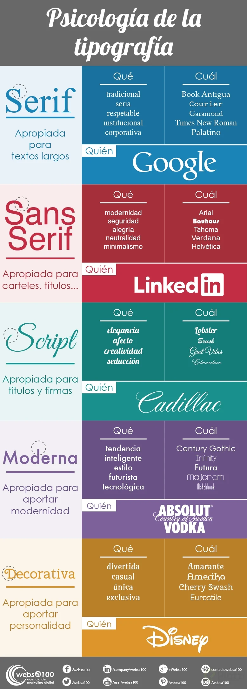

# TIPOGRAFIA 

- Maximo 2 tipos de tipografías.
- Limitar la cantidad de texto.
- Tipografias que sean legibles en diferentes tamaños.
- Utilizar line-heigth.
- Tener Contrastes.

- Script es una fuente cursiva, solo para textos cortos
- Usar google Fonts

