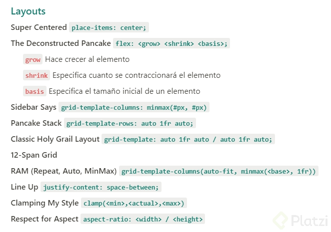

https://github.com/platzi/CSS2020#4-contextos-de-formato-formato-de-contexto-de-bloque-bfc

Apuntes de la clase:

Block formatting context (BFC)

Es el layout interno de un elemento, que se comporta de manera independiente a como se comporta el resto de la página

Si bien maneja la estructura interna de un elemento, utilizando position se puede sacar al elemento del flujo normal del documento, haciendo que este se reordene de una forma distinta

¿Que pasa con flexbox y grid?

Ambos formatos nacieron con la intensión de facilitar el diseño de la página. Mientras flexbox se basa en un formato donde se le da flexibilidad a los elementos y al contenedor, grid adquiere un formato de cuadricula** realmente facil de ordenar**

¿E Inline-block?

Inline-block es bastante facil de entender. Consta en una fusión de ambas partes, donde al igual que inline-flex e inline-block, externamente el elemento se situa de forma inline, pero por dentro puede adoptar propiedades block como width, left, etc…
Da un BFC en una caja en línea.

Sobre flow-root
Da un BFC en una caja de bloque

Aquí dejo más documentacion al respecto
https://www.programandoamedianoche.com/2018/05/conoce-flow-root-la-solucion-al-desborde-de-un-elemento-con-float/
https://www.campusmvp.es/recursos/post/display-flow-root-para-limpiar-floats-css.aspx

************************************************
************************************************
************************************************

Contexto de apilamiento
⏬ Posicionamiento
<h4>Ideas/conceptos claves</h4>
mix-blend-mode

La propiedad mix-blend-mode define cómo debe combinarse el contenido de un elemento con su fondo.

<h4>Apuntes</h4>
Todo son cuadros en nuestros sitios web

Podemos controlar el tipo de cuadro que se genera utilizando la propiedad display
Positions ⇒ Nos ayudan a manipular la ubicación de un elemento

En la parte superior
Uno alado de otro
Uno encima de otro ⇒ Estaremos hablando de contexto de apilamiento
“El contexto de apilamiento es la conceptualización tridimensional de los elementos HTML a lo largo de un eje-Z imaginario relativo al usuario que se asume está de cara al viewport o página web. Los elementos HTML ocupan este espacio por orden de prioridad basado en sus atributos.”

Cuando trabajamos con la web debemos trabajar con 3 ejes
Ejes X & Y
Eje Z imaginario ⇒ Desde la pantalla hasta la vista del usuario
Cajas que se van sobreponiendo
Ejemplo ⇒ Un modal se pone encima de todo nuestro sitio web
El contexto de apilamiento es como una pila que se va ubicando por orden de prioridad
No todos los elementos pueden crearlo
Un contexto de apilamiento es formado, en cualquier lugar del documento, por cualquier elemento que:
Sea el elemento raíz (HTML)
Tenga posición (absoluta o relativa) con un valor z-index distinto de auto
Position: fixed
Un elemento flex con un valor z-index distinto de auto, que sera el elemento padre display: flex/inline-flex
Sean elementos con un valor opacity menor de 1
Elementos con un valor transform distinto de none
Elementos con un valor mix-blend-mode distinto de normal
Elementos con un valor filter distinto de none
Elementos con un valor perspective distinto de none
Elementos con un valor isolation igual a isolate
Especifican cualquier atributo superior en will-change incluso si no especificas valores para estos atributos directamente
Elementos con un valor -webkit-overflow-scrolling igual a touch

*********************************************************
*********************************************************
*********************************************************

<h3>Diferencias entre flexbox y CSS grid</h3>
Flexbox

Nos ayuda a distribuir los elementos y alinearlos, es unidireccional, eso quiere decir que solo va en un a dirección, va vertical o va en horizontal.

Las propiedades que tiene un contenedor padre en flexbox son:

display
flex-direction
flex-wrap
flex-flow
justify-content
align-items
align-content
Las propiedades de elementos hijos son:

order
floex-grow
flex-shrink
flex-basis
flex
align-self
Grid

Nos permite alinear elementos en filas y columnas, es bidemensional, podemos alinear elementos en dos direcciones.

Las propiedades de contenedores padre son:

display
grid-template
gap
justify-items
align-items
justify-content
align-content
Propiedades de elementos hijo

grid-column
grid-row
grid-area
justify-self
align-self

*********************************************************
*********************************************************
*********************************************************

https://web.dev/one-line-layouts/
https://gridbyexample.com/resources/

https://cantunsee.space/

https://www.atsistemas.com/es/blog/que-son-tokens-diseno
https://neumorphism.io/#e0e0e0

Tips:
• Jerarquía
• Contraste
• Proximidad
• Balance
• Responsive design
• Ilustraciones animadas
• Garantizar performance
• Micro interaciones
• Realidad aumentada y realidad virtual
• Neo morfismo
• Asymmetrical layouts
• Storytelling

