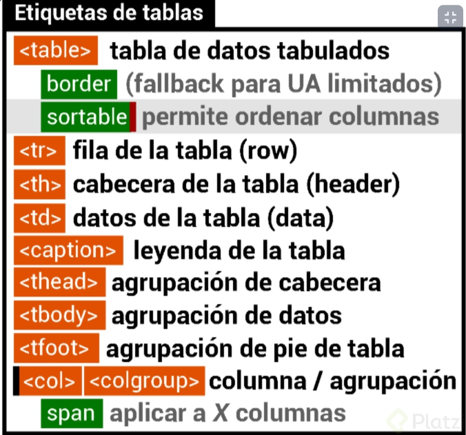

C:\Users\Xavi\Desktop\HTML-CSS

font-family: 'DM Sans', sans-serif;
font-family: 'Inter', sans-serif;

para ver que juego de fonts usar:
https://www.fontpair.co/

***
https://es.accentsconagua.com/articles/webdesign/an-introduction-to-the-bem-methodology.html

https://www.figma.com/file/sMmlQaZldfDcLERYYWe6h4/Bata-Bit?node-id=83%3A277&mode=dev